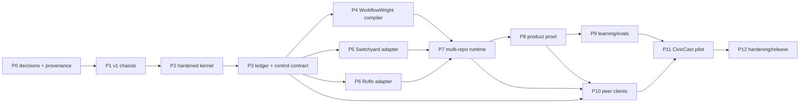

# DevHarmonics Next — Implementation Plan

**Status:** Draft for owner review  
**Depends on:** [`SYSTEM_SPEC.md`](./SYSTEM_SPEC.md) and [`workflow-spec.json`](./workflow-spec.json)  
**Current authorization:** Planning only. Do not import source, install runtimes, migrate data, or write product code until Scott approves the architecture and blocking decisions.

## 1. Delivery strategy

Implement DevHarmonics Next as a convergence, not as a third supervisor:

1. establish the approved source/provenance topology;
2. prove DevHarmonics v1 as the durable runtime and cockpit baseline;
3. port the current DevHarmonics hardened kernel into that baseline;
4. stabilize the one ledger and one control contract;
5. compile WorkflowWright designs into that runtime;
6. integrate full Switchyard and Ruflo sources behind narrow authority-preserving adapters;
7. add the multi-repository product-proof workflow;
8. expose the same state to chat, mission control, CLI, and the MMR skill; and
9. prove the system against a preserved CivicCast failure before trusting a live delivery.

Every phase is a vertical slice with an executable exit gate. A phase is not complete because code was copied, an MCP tool registered, an agent was spawned, or a test command returned zero without expected evidence.

## 2. Meaning of “integrated wholesale”

For Switchyard and Ruflo, wholesale integration means:

- the complete selected upstream source is present through the approved fork/subtree/vendor mechanism;
- its exact upstream URL, commit, tree, license, notices, and local patch set are recorded;
- the pristine pinned source builds and passes its own relevant tests before local patches;
- local changes remain attributable and reviewable against upstream;
- the product can expose additional upstream capabilities later without reacquiring snippets; and
- every capability admitted to a DevHarmonics run has a live contract test.

It does **not** mean that all plugins start automatically, all overlapping schedulers become authoritative, all tools receive project access, or instruction-only features are advertised as working. Capability state is tracked as:

`present → native-build-proven → contract-proven → admitted → enabled-for-profile`

This preserves the full code while allowing a controlled product boundary.

## 3. Component migration map

| Source | What moves forward | What does not become a second authority |
|---|---|---|
| DevHarmonics v1 | Local server/UI, SQLite migrations and ledger, objectives, immutable plans, DAG scheduler, product registry, worktrees, integrations, review/fix workflow, reconnectable events, decisions, and delivery actions | Older execution/safety behavior that is superseded by the current hardened kernel |
| Current DevHarmonics | ACP/HTTP/subprocess lanes, admission, budgets, slots, cancellation, executable identity/tamper checks, path/environment/prompt hardening, two-phase integration sets, JSON/JSONL receipts, and falsification tests | A parallel supervisor, independent lifecycle, or second canonical receipt store |
| WorkflowWright | Spec schema, code/agent/human assignment, named payloads, loop/budget validation, renderer, and a compiler adapter | Its standalone Python scheduler during a production DevHarmonics run |
| Switchyard | Complete pinned source, translation protocols, router implementations, launchers, library/server surfaces, headers/logs/metrics, fallback and context handling | Project/task scheduling, privacy-policy expansion, source authority, or release decisions |
| Ruflo | Complete pinned source, MCP/core, swarm patterns, roles, AgentDB/RAG, sessions, hooks, observability, policy/security surfaces, goals, and selected plugins | Canonical run/task state, write leases, acceptance, or proof of execution from registration alone |
| Multi-model-routing skill | Triggering, client workflow, local/backend discovery, benchmark discipline, machine-local notes, cross-harness adapters, installer safety, and concise operator explanations | A database, scheduler, hidden agent runtime, or duplicate routing truth |

Before implementation, the team creates an overlap register. For every duplicated scheduler, router, memory store, approval gate, retry system, or ledger, it records one of: `authoritative`, `adapter`, `projection`, `disabled`, or `removed after migration`.

## 4. Adapter contracts to freeze early

These are conceptual interfaces; exact language/module shapes follow the repository decision.

| Contract | Required behavior |
|---|---|
| Workflow compiler | Validate an immutable spec/plan revision and emit a deterministic DevHarmonics graph plus diagnostics. |
| Swarm coordinator | Accept bounded work packages, report worker/coordination events, support cancel/health/resume, and never grant canonical completion. |
| Executor | Start, resume, cancel, health-check, declare capabilities/tools/write scope, and return a normalized non-empty receipt. |
| Model router | Accept a fixed policy envelope and correlation IDs; return actual route/target/fallback/usage/latency without escaping policy. |
| Verifier | Run in a declared proof boundary against exact inputs and return normalized claims/findings with hashes. |
| Artifact builder | Consume an integration lock and emit an artifact, manifest, source binding, SBOM, and notices. |
| Journey runner | Exercise a pre-approved product journey against an exact artifact/environment and distinguish automated from physical evidence. |
| Memory projection | Rebuild advisory Ruflo memory from ledger records and retain provenance, outcome, expiry, and supersession. |
| Client transport | Expose the same commands, events, decisions, and evidence through API, MCP, CLI, and UI. |

## 5. Phase plan

### Phase 0 — Approve topology and freeze provenance

**Purpose:** Resolve choices that would otherwise be silently made by the implementation.

Blocking decisions:

- D1 product repository;
- D2 upstream source topology;
- D3 DevHarmonics baseline;
- D4 dynamic workflow representation; and
- D5 native Windows/WSL/split host boundary.

Later decisions D6–D12 receive owners and decision deadlines but need not all block the first characterization tests.

Work after approval:

- create the selected integration branch/repository without modifying the released branches of the existing projects;
- record all six reviewed source commits in `UPSTREAM_SOURCES.lock`;
- preserve every LICENSE and NOTICE at its source boundary;
- create `THIRD_PARTY_NOTICES.md`, `LICENSES/`, and modification/patch ledgers;
- generate a source SBOM and establish dependency-license policy;
- define the overlap register and ownership matrix from the system spec;
- capture build/test commands and supported host assumptions for each pristine source; and
- define migration and rollback checkpoints for code, configuration, and SQLite data.

**Exit gate:** Scott has accepted D1–D5; every imported source can be traced to an exact commit and license; no component has two authoritative owners; the existing repositories remain recoverable and releasable.

### Phase 1 — Prove the DevHarmonics v1 chassis

**Purpose:** Start from a working durable product surface rather than recreate one from design prose.

Work:

- build and run pristine `devharmonics-v1` at the locked commit on the selected host boundary;
- run its native tests and record a baseline capability matrix;
- characterize the local server, dashboard, SQLite schema/migrations, objective and immutable-plan model, DAG scheduling, project registry, worktrees, integrations, reviewer/fixer flow, decisions, event reconnect, and delivery behavior;
- create golden fixtures for one project, one multi-repository objective, one interrupted run, one decision, and one delivery plan;
- document every v1 behavior the new system must preserve or intentionally migrate; and
- prove backup/restore using a copied database and workspace, never the owner's live data.

**Tests:** clean start, repeated start, browser reconnect, process kill/restart at each durable transition, stale worker, duplicate event, migration on a cloned database, and dashboard/API agreement.

**Exit gate:** The pinned v1 server and mission control can create, execute, interrupt, resume, and inspect a fixture from SQLite alone; the baseline behavior and data are reproducible.

### Phase 2 — Port the current hardened execution kernel

**Purpose:** Put current DevHarmonics' strongest safety and execution behavior under the v1 scheduler and ledger.

Port as vertical slices:

1. admission and executable identity;
2. ACP lane;
3. HTTP lane;
4. subprocess lane;
5. budget/slot/cancel semantics;
6. receipt normalization;
7. two-phase integration sets; and
8. verifier isolation.

Mandatory behaviors and regression cases:

- exact executable path/version/hash or configured tamper-check identity;
- prompts and large payloads sent on stdin rather than command-line arguments;
- refusal of newline-bearing untrusted arguments;
- realpath/lstat containment against symlink/junction read or write escape;
- stripped validator environments that do not leak credentials;
- lock, slot, and receipt forgery rejection;
- non-empty evidence requirements and empty-diff detection;
- per-attempt and global budget accounting;
- idempotent cancellation and cleanup; and
- prepare/verify/commit integration receipts that cannot represent a partial set as complete.

Reuse the current falsification suite as executable migration criteria. Add an intentionally vulnerable fixture where needed so each test is known to detect the original defect.

**Exit gate:** A v1-scheduled fixture executes through all selected current-kernel lanes, writes normalized ledger receipts, survives restart/cancel, and passes every ported falsification test without retaining a competing supervisor or receipt authority.

### Phase 3 — Establish the canonical ledger and control contract

**Purpose:** Give every UI, chat host, adapter, and subsystem one durable API and state model.

Work:

- design versioned migrations from the characterized v1 schema rather than replacing it in place;
- add the canonical records and state machines from the system spec;
- maintain append-only events alongside normalized current-state tables;
- add content-addressed evidence storage and portable JSON/JSONL receipt export;
- implement idempotency, leases, budgets, pause/resume/cancel, exhaustion, invalidation, and crash recovery as transactions;
- define stable local API/MCP/CLI operations and an event stream for the v1 UI and chat clients;
- propagate run/work-package/attempt/model-call correlation IDs through every adapter boundary;
- require human-decision records for intake, exhaustion, acceptance, and external actions; and
- add reconciliation that detects impossible states, missing evidence, stale source, duplicate claims, and orphaned processes.

**Tests:** kill before/after every transaction, replay/duplicate events, resume twice, corrupt or remove evidence, fill disk, lose child processes, cancel during each execution lane, and reconnect multiple clients.

**Exit gate:** One fixture run can be controlled from two clients and reconstructed entirely from the ledger after all processes are killed; both clients display the same state and no chat history is required.

### Phase 4 — Integrate WorkflowWright as the design compiler

**Purpose:** Make process architecture reviewable and structurally valid before it becomes runtime state.

Work:

- preserve the pinned WorkflowWright source/license through the selected topology;
- import its schema validation and rendering as a DevHarmonics design service or adapter;
- define the mapping from WorkflowWright nodes/edges/evidence/budgets to immutable DevHarmonics workflow revisions;
- implement the approved dynamic-child strategy for `build_swarm` while keeping every child visible and budgeted;
- add project extensions for governance contracts, leases, proof boundaries, route intents, invalidation, and exact artifact journeys;
- keep standalone scaffold/export available for isolated tests or portability, but never launch it beside the production scheduler;
- display the rendered design and diagnostics in mission control and make them available to chat clients; and
- version changes as new workflow/plan revisions rather than editing an active run's meaning.

**Tests:** missing payload, sink without a failure path, evidence without a failure path, unbounded loop, invalid backend, malformed dynamic child, stale workflow revision, compile determinism, and delegate versus unattended equivalence.

**Exit gate:** The checked-in workflow spec renders cleanly, rejects seeded structural defects, compiles to a DevHarmonics graph, and runs a small code→agent→check→human fixture with identical bounds after restart.

### Phase 5 — Integrate Switchyard wholesale as the model data plane

**Purpose:** Route real model turns through local and permitted remote targets with complete policy and outcome receipts.

Work:

- import/build the complete pinned Switchyard source and run its native protocol/router tests unmodified first;
- choose its embeddable-library, supervised-service, or hybrid boundary according to D5 and measured failure behavior;
- implement the DevHarmonics model-router adapter and logical route intents;
- generate target configuration from live model inventory and policy rather than freezing transient model IDs;
- verify OpenAI Chat, OpenAI Responses, Anthropic Messages, streaming, tool calls, cancellation, context overflow, and error translation needed by admitted executors;
- propagate correlation IDs and ingest route headers, decisions, target health, fallback chains, tokens, latency, and errors into the ledger;
- enforce local-only and data/account policy before Switchyard receives a request;
- model local memory, model residency, context size, and swap cost as scheduler resources for the 128 GB host;
- verify Codex/Claude launchers only where the pinned implementation and selected host support them; and
- add route replay/shadow fixtures without changing production policy.

**Tests:** every admitted protocol pair, buffered/streamed responses, malformed tools, target outage, rate limit, invalid response, cancellation, service restart, model swap/thrash, privacy violation, and silent-fallback injection.

**Exit gate:** A real admitted executor turn can reach a local LM Studio/Ollama target through Switchyard, produce a correlated route receipt, escalate only inside policy, and visibly fail rather than cross a local-only boundary.

### Phase 6 — Integrate Ruflo wholesale as the swarm subsystem

**Purpose:** Add the full coordination and memory platform without surrendering DevHarmonics authority.

Work:

- import/build the complete pinned Ruflo source and run native tests before patches;
- run full `ruflo init` only in a disposable fixture and diff every file, registration, process, and configuration it creates;
- build a live capability matrix from source, CLI/MCP discovery, and contract smokes rather than README tool counts;
- implement the DevHarmonics swarm-coordinator adapter for create, assign, health, event, cancel, shutdown, and resume;
- connect Ruflo tasks to real DevHarmonics executor adapters and require normalized outputs/receipts before completion;
- prove AgentDB/RAG persistence, namespaces, export/rebuild, provenance, expiry, and supersession;
- prove or disable RVF/session, workflow/autopilot, hooks, security/policy, observability, cost, goal, Metaharness, and plugin surfaces one capability at a time;
- restrict hooks/plugins to manifest-declared tools, network, secrets, and writable paths;
- correlate Ruflo swarm/worker/task/session records to canonical DevHarmonics IDs; and
- explicitly disable or adapt native scheduling/retry/approval behavior that would conflict with the DevHarmonics state machine.

**Tests:** registration without execution, worker/daemon crash, stale worker, duplicate claim, lost lease, memory conflict, cross-project leakage, MCP restart, unconfigured plugin, hostile hook, cancel/shutdown, and restart reconstruction.

**Exit gate:** A Ruflo-coordinated fixture causes real executor work in an isolated scope, survives process restart, and agrees with canonical DevHarmonics state; deleting the Ruflo projection does not lose exact run truth.

### Phase 7 — Implement dynamic multi-repository delivery

**Purpose:** Make the project graph, concurrency, and integration semantics first-class.

Work:

- define and validate the project manifest, workspace lock, governance contract, dependency graph, delivery plan, workflow revision, work-package DAG, candidate lock, and integration lock;
- adapt the v1 project registry and worktree model to multi-repository workspaces and selected VM/container profiles;
- discover candidate repositories but require product-contract approval before adding them to the run;
- model source, package, API, schema, migration, artifact, test-control, release, and deployment edges;
- derive work packages, dependencies, allowed paths, exclusive resources, executor capabilities, checks, and invalidation rules;
- expand the ready frontier into visible ledger child nodes and choose swarm topology from the graph rather than a fixed agent count;
- enforce canonical-path write leases and detect file/service/port/device/cache/model-residency collisions;
- broadcast accepted contract changes to dependents and invalidate stale downstream plans/evidence;
- use the hardened two-phase integration-set protocol for exact candidate SHAs; and
- expose concise progress plus the full child DAG in mission control and client events.

**Tests:** at least three repositories; dirty/detached/missing source; renamed branches; dependency cycle; parallel same-file writes; shared cache/port collision; model-swap pressure; contract drift; source change after verification; and interrupted integration prepare/commit.

**Exit gate:** A three-repository fixture runs independent packages concurrently, prevents seeded collisions, reconstructs after interruption, and invalidates every dependent check/artifact when one source SHA changes.

### Phase 8 — Build independent verification, artifacts, and product proof

**Purpose:** Verify the product that would be used or shipped, not just the source agents edited.

Work:

- consolidate v1 reviewer/fixer behavior and current verifier hardening into one bounded producer/checker loop;
- implement normalized adapters for tests, lint, types, policy, security, mutation where useful, and project-specific checks;
- separate fast repair checks from full acceptance checks;
- run suites in clean processes and in declared combined-process profiles;
- implement cross-repository contract, migration, package-consumer, service, end-to-end, upgrade, and rollback checks;
- build only from an exact integration lock;
- generate source probes, hashes, source-to-artifact bindings, SBOM, notices, and signatures where configured;
- install/run/uninstall or deploy/rollback the exact artifact in a clean profile;
- execute the original approved product journeys against that artifact with screenshots/logs/state and explicit physical limits;
- perform the cold independent acceptance audit; and
- generate one concise claim-level acceptance packet.

Mandatory fault injections:

- stale installer/payload pack;
- source changed after build;
- forged or empty receipt;
- cached test result from another SHA;
- missing runtime dependency;
- cross-suite pollution;
- interrupted installer or deployment;
- false healthy/idle worker state;
- self-designed API walkthrough substituted for the approved journey; and
- UI/product defect hidden behind passing APIs.

**Exit gate:** Every acceptance claim resolves to exact source or artifact evidence, and all seeded stale-artifact, false-completion, cross-pollution, and product-journey defects are caught before Scott's gate.

### Phase 9 — Close the learning and route-evaluation loop

**Purpose:** Turn runs into better future decisions without allowing early mistakes to self-promote.

Work:

- define the trajectory/outcome join and redact secrets before retention or export;
- distinguish accepted, rejected, repaired, superseded, and environmental outcomes;
- build the rebuildable Ruflo memory projection with provenance, expiry, and supersession;
- build a versioned evaluation corpus from work packages, integration failures, artifacts, and journeys;
- join Switchyard route decisions to deterministic and human outcomes;
- compute local-safe, loss, rescue, both-pass, both-fail, and source-pass/artifact-fail comparisons;
- support fixed-payload replay, shadow routes, and counterfactual comparisons where policy permits;
- produce prompt, skill, deterministic-rule, adapter, route, or model promotion proposals;
- require the configured human gate before production promotion; and
- retain rollback to the previous version for every promoted behavior.

**Tests:** poisoned/stale memory, contradictory evidence, secret-bearing trace, skewed corpus, route regression, false cost win, promotion race, failed projection rebuild, and rollback.

**Exit gate:** One accepted and one rejected run produce correctly labeled, replayable records; a candidate route/prompt can be compared and proposed without mutating production configuration.

### Phase 10 — Deliver the peer operator clients

**Purpose:** Make the runtime practical for Scott from both chat and mission control.

Mission-control work:

- modernize the v1 UI against the canonical control contract;
- add product/repository topology, immutable plan revisions, compiled workflow, dynamic swarm/DAG, leases, model resources, evidence freshness, artifact/journey views, budgets, recovery, and decision panels;
- preserve reconnect and process-independent operation; and
- keep all browser state reconstructable from the API.

Chat/skill work:

- refactor the MMR skill into a concise trigger/operator layer following the skill-creator guidance;
- keep detailed setup, routing, recovery, and schema material in one-level references and deterministic scripts;
- expose MCP/CLI adapters for supported OpenWork, Claude, Cowork, Codex, Antigravity, and other compatible hosts;
- support WorkflowWright delegate mode for interactive agent nodes and unattended DevHarmonics execution for long runs;
- make natural-language status report product progress, evidence, blockers, budgets, and decisions rather than raw chatter;
- update installation, doctor, registration, upgrade, and safe uninstall behavior; and
- preserve machine-local notes/configuration and never remove unrelated MCP entries or processes.

**Tests:** same run opened concurrently in UI and two clients; client disconnect/reconnect; conflicting commands; stale event cursor; decision from one client visible in all; fresh-agent trigger tests; clean/repeat/upgrade/uninstall; and missing dependency/occupied port/offline restart.

**Exit gate:** Scott can start in chat, inspect and recover in mission control, decide in either client, and receive the same concise evidence-backed result from one ledger. A fresh supported host invokes the skill correctly without learning hundreds of Ruflo tools.

### Phase 11 — Replay CivicCast and run a bounded live pilot

**Purpose:** Prove that the new architecture changes the real failure outcome.

Run A — preserved failure replay:

- choose D9 and reconstruct the exact source/artifact/process boundary from preserved evidence;
- seed the selected failure without exposing its answer to producer agents;
- execute from product contract through artifact journey and acceptance packet;
- verify the intended gate detects it; and
- compare false claims, manual handoffs, elapsed time, calls/meters, recovery effort, and evidence quality to the historical run.

Run B — live bounded delivery:

- select a new change spanning at least two repositories or one product plus release/test-control boundary;
- approve the project manifest, original journeys, authority, and budgets;
- allow real isolated writes and real local/cloud executor routes;
- build and verify the real artifact; and
- stop at Scott's disposition gate unless the decision explicitly authorizes an exact external action.

**Exit gate:** Every first-pilot criterion in the system spec passes. Any miss is a product defect to fix; high agent activity or partial output does not waive it.

### Phase 12 — Harden and publish

**Purpose:** Turn a successful personal runtime into a reproducible public tool without weakening Scott's workflow.

Work:

- test clean supported Windows and Linux/WSL boundaries and their split-service cases;
- publish exact upstream pins, local patch sets, licenses, notices, SBOMs, checksums, and capability matrix;
- distinguish present, native-build-proven, contract-proven, admitted, and enabled capabilities in public claims;
- add upstream update reports and patch-conflict previews before applying changes;
- test database/config/workflow migration and rollback across released versions;
- threat-model MCP tools, hooks/plugins, executors, subprocesses, secrets, local services, network endpoints, UI actions, and writable paths;
- run large-swarm, long-run, restart, model-thrash, disk-pressure, and event-stream soak tests;
- produce reproducible release artifacts and safe uninstall; and
- forward-test public install and product-delivery flows with fresh agents and clean projects.

**Exit gate:** A clean supported machine can install, verify, run, recover, upgrade, roll back, and remove the public release; every advertised end-to-end claim is backed by the CivicCast pilot and reproducible evidence.

## 6. Dependencies and safe parallel work

After P3 freezes the contracts, pristine Switchyard work, pristine Ruflo work, and WorkflowWright compilation can proceed in parallel. They converge only through reviewed adapters. UI characterization begins in P1, but the final client work waits for the canonical contract and evidence model. Learning data capture begins with P3, while promotion behavior waits for P8 outcomes.

## 7. Requirement traceability

| Requirements | Primary phases |
|---|---|
| FR-01 one runtime; FR-02 crash recovery | P1–P3, P10 |
| FR-03 workflow compilation; FR-04 governance lock | P4, P7 |
| FR-05 multi-repo graph; FR-06 dynamic swarms | P6–P7 |
| FR-07 real execution; FR-09 hardened kernel | P2–P3, P6 |
| FR-08 model data plane; FR-13 local-first routing | P5, P7, P9 |
| FR-10 deterministic verification; FR-11 independent audit | P8 |
| FR-12 human disposition | P3, P8, P10–P11 |
| FR-14 learning join | P9 |
| FR-15 wholesale provenance | P0, P5–P6, P12 |
| FR-16 cross-harness access; FR-17 mission control | P10 |

## 8. Test architecture

| Layer | What it proves | Representative evidence |
|---|---|---|
| Pristine upstream | The exact pinned source works before adaptation. | Native builds/tests and immutable logs. |
| Characterization | Existing DevHarmonics behavior is known before convergence. | Golden v1/current fixtures and behavior matrix. |
| Falsification | A safety claim catches the defect it names. | Vulnerable fixture fails; integrated kernel passes. |
| Contract | DevHarmonics can rely on one adapter behavior. | Start/resume/cancel, route, swarm, persistence, and evidence smokes. |
| State/property | Transactions and deterministic transitions are correct. | Idempotency, cycles, leases, budgets, invalidation, event replay. |
| Failure injection | Recovery does not create false completion. | Kill/restart, missing receipt, stale source, service/model outage. |
| Multi-repo fixture | Dependency and concurrency logic is real. | Three repositories with seeded contract and collision failures. |
| Artifact | The delivered bytes contain the intended source and dependencies. | Hashes, embedded probes, SBOM/notices, clean install/rollback. |
| Product journey | The contracted user can achieve the outcome. | Cold journey record with screenshots/logs/state and limits. |
| Independent audit | Claims are supported and non-circular. | Claim/evidence matrix and cold verdict. |
| Routing/learning | Local savings preserve quality and remain reversible. | Fixed-corpus replay, shadow comparison, promotion/rollback receipt. |
| Client | Chat, UI, MCP, and CLI share one state. | Cross-client consistency and reconnect tests. |
| License/release | Distributed source and artifacts satisfy obligations. | Source lock, notices, license scan, SBOM, reproducible artifact. |

## 9. Migration and rollback rules

- Keep the current public branches of the MMR skill, DevHarmonics, and devharmonics-v1 intact until the selected pilot passes.
- Build the convergence in the approved new branch/repository and integrate by reversible vertical slices.
- Never run Ruflo initialization against an active product repository until a disposable fixture has captured and approved its complete mutation set.
- Never migrate the only copy of a v1 SQLite database. Back up, checksum, copy, migrate, verify, and retain the pre-migration reader and rollback instructions.
- Keep upstream source data separate from mutable run/configuration data so upgrades or uninstall cannot erase evidence.
- Record every process, service, MCP registration, config key, port, and filesystem location owned by DevHarmonics; uninstall touches only those owned resources.
- Version adapter contracts, workflow definitions, database schemas, project manifests, route policies, and capability matrices.
- Pin all production inputs. Upgrades are explicit runs with diff, tests, migration receipt, and rollback point.
- Pilot only in isolated CivicCast workspaces. No merge, tag, release, deployment, or destructive cleanup follows merely from this plan.

## 10. Overall definition of done

DevHarmonics Next is implemented only when:

- one durable runtime can complete and recover the checked-in workflow;
- v1 product/runtime capabilities and current kernel guarantees are demonstrably preserved;
- WorkflowWright, Ruflo, and Switchyard each operate within the authority map;
- every dynamic child, executor action, model turn, check, artifact, journey, and decision is correlated and inspectable;
- chat and mission control present the same run without hidden state;
- the CivicCast replay and live pilot pass all acceptance criteria; and
- the public source/artifact provenance and licenses are complete.

## 11. Review order before implementation

1. Review the product boundary and one-owner authority table in the system spec.
2. Confirm or change D3: v1 chassis plus current hardened kernel.
3. Choose D1/D2: product repository and wholesale source topology.
4. Choose D4/D5: dynamic workflow representation and host boundary.
5. Review the canonical lifecycle, especially governance lock and artifact-first journey order.
6. Choose D6–D12 when their phase approaches; no phase may silently select one.
7. Edit the first-pilot criteria until they describe a result Scott would personally trust.

After items 1–5 are accepted, implementation can begin at Phase 0. New material product choices discovered during coding return as decision records with evidence and options; they are not buried in an adapter implementation.

