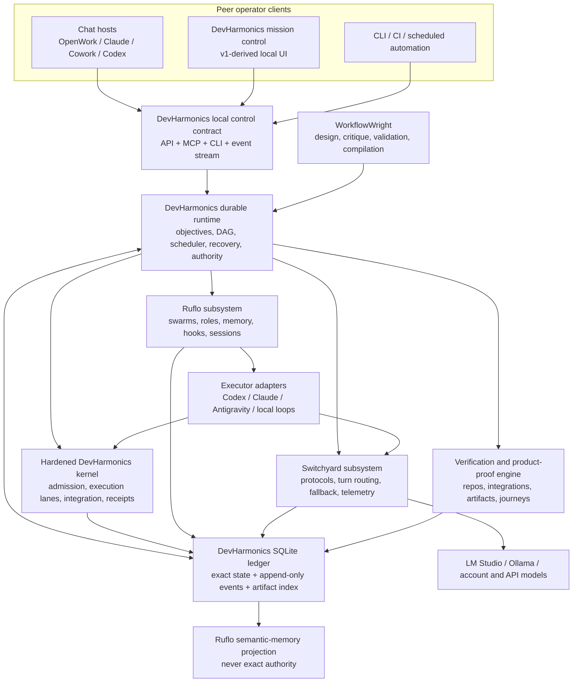

# DevHarmonics Next — Integrated Product Delivery Runtime

**Status:** Draft architecture specification for Scott's review  
**Planning snapshot:** 2026-08-11  
**Authorization:** Design only. This document does not authorize source imports, runtime changes, installs, releases, or other implementation work.

## 1. Product outcome

DevHarmonics Next is a local-first product-delivery system for a solo, non-programming product operator working across several related repositories. It should accept a product outcome, discover the real system around it, coordinate as many agents as the work and hardware justify, produce an integrated artifact, exercise the product as a user, and present one trustworthy acceptance decision.

The system must be usable from either:

- a DevHarmonics mission-control interface derived from v1;
- a chat host such as OpenWork, Claude, Cowork, Codex, or another MCP-capable client; or
- a headless CLI/automation client.

Those are peer clients. They must not create separate plans, histories, or notions of current state. All of them operate one DevHarmonics runtime through one local control contract and one durable ledger.

This design intentionally permits large swarms and wholesale upstream integration. The constraints are evidence, authority, safety, and recoverability—not minimal dependency count or upstream maturity labels.

## 2. Direction fixed by this design

The following is the architecture being specified. Items that still require Scott's choice are isolated in section 18.

1. **DevHarmonics is the product and runtime authority.** Its database owns objectives, plans, runs, task state, source locks, evidence, approvals, recovery, and release disposition.
2. **DevHarmonics v1 is the proposed runtime chassis.** It already contains the durable server, SQLite ledger, objective/plan/DAG model, project registry, worktrees, integrations, delivery workflow, reconnectable events, and operator dashboard.
3. **The current DevHarmonics repository is the hardened execution kernel to port into that chassis.** Its ACP/HTTP/subprocess lanes, admission controls, slot/budget enforcement, identity/tamper checks, two-phase integration sets, receipts, and falsification tests must survive the convergence.
4. **WorkflowWright is the workflow design and compilation layer.** It assigns work to code, agents, and humans; validates payloads and bounded failure paths; and compiles an approved lifecycle into a versioned DevHarmonics workflow definition. It is not a second production scheduler.
5. **Ruflo is integrated wholesale beneath DevHarmonics.** It supplies swarm coordination, roles, memory/RAG, hooks, session facilities, and selected plugins. It does not own canonical run state or release authority.
6. **NVIDIA NeMo Switchyard is integrated wholesale beneath DevHarmonics.** It supplies protocol translation, model-turn routing, fallback, launcher support, and model-call telemetry inside policy lanes chosen by DevHarmonics. It does not choose repository tasks or product disposition.
7. **The multi-model-routing skill becomes the concise cross-harness client and distribution layer.** It retains model discovery, routing knowledge, machine-local configuration, installer behavior, and natural-language triggers without becoming another database or scheduler.
8. **Every claim is bound to the thing it proves.** Source checks bind to exact SHAs; product claims bind to exact artifacts and environments; coordination records never count as execution evidence.

The choice of physical repository topology, host boundary, install profiles, initial budgets, and first pilot remains open.

## 3. Why this architecture exists

The design is grounded in the supplied transcript and the preserved CivicCast delivery history rather than an idealized agent workflow.

| Observed failure | Concrete evidence | Architectural requirement |
|---|---|---|
| Internal tests passed while the newcomer product journey still failed. | The CivicCast overnight handoff reports thousands of passing tests followed by a walkthrough verdict of 3 PASS / 4 FAIL / 1 PARTIAL, 23 findings, and four critical findings. | Product journeys against the candidate artifact are independent acceptance gates. |
| The artifact did not contain the source that had been verified. | Most fixes had not reached the installer; one stale payload pack silently shipped old Python and consumed a real-hardware run. | Source-to-artifact bindings, clean artifact verification, and invalidation are mandatory. |
| State and authority were spread across chats, handoffs, branches, worktrees, and audit repositories. | The CivicCast workspace contains many active and stale worktrees plus separate tester, audit, release, and recovery records. | One transactional ledger and one current lock are authoritative; prose handoffs are generated views. |
| Coordination was mistaken for execution. | A tester remained idle after acquisition while the coordinator described the system as waiting; Ruflo itself distinguishes coordination from executor work. | A task completes only with a normalized, non-empty execution receipt and independently checked result. |
| Claims repeatedly outran evidence. | The handoffs include retractions, one-machine conclusions generalized to a fleet, and defects found only by a later coordinator. | Claim-level evidence, proof-boundary labels, and cold independent audit are first-class records. |
| Audits used a process invented inside the run instead of the project's existing workflow. | The earlier CivicCast handoff identifies the root failure as substituting a self-designed process for an existing one and then trusting its output. | Project governance, required skills, journeys, and proof rules are loaded and locked before planning. |
| Test suites passed alone and failed together. | Roughly 44 cross-pollution failures appeared only when suites shared a process. | Verification profiles cover both clean isolation and intentionally combined execution. |
| Local compute was available but lacked an outcome loop. | The transcript emphasizes supervised routing, observable traces, escalation, and learning from accepted outcomes. | Every task and model-turn route joins to deterministic and human outcomes for later evaluation. |

## 4. System boundary

## 5. One owner for each concern

Overlapping upstream features are admitted only behind this authority map.

| Concern | Authoritative owner | Subordinate/supporting components |
|---|---|---|
| Product objectives, contracts, and decisions | DevHarmonics | Chat and cockpit collect/display them. |
| Versioned workflow definition | DevHarmonics | WorkflowWright authors, validates, and compiles it. |
| Runtime DAG, dynamic expansion, scheduling, leases, retries, recovery | DevHarmonics | Ruflo coordinates workers assigned by the scheduler. |
| Exact run/task/attempt state | DevHarmonics SQLite ledger | Ruflo and UI hold projections only. |
| Deterministic execution admission and process safety | Hardened DevHarmonics kernel | Executor adapters invoke it. |
| Swarm topology, role collaboration, hooks, session/memory services | Ruflo | DevHarmonics supplies work packages, bounds, and authority. |
| Task/harness selection | DevHarmonics policy layer | MMR knowledge and live capability discovery inform it. |
| Model selection inside an approved lane | Switchyard | DevHarmonics supplies policy constraints and correlation IDs. |
| Agent loop and tool use | Selected executor harness | Ruflo may coordinate; Switchyard may route model turns. |
| Repository verification, integration, artifact proof, product journeys | DevHarmonics verification engine | Deterministic tools and independent agent auditors execute checks. |
| Semantic retrieval and reusable procedural memory | Ruflo projection | Every memory item points back to exact ledger evidence and outcome. |
| Merge, tag, release, deployment, destructive actions | Scott or explicitly delegated project authority | DevHarmonics executes only the exact approved action and receipts it. |

Consequences:

- Ruflo's task state cannot overrule DevHarmonics state.
- WorkflowWright's generated standalone Python runner is an export/test surface, not a second scheduler in production.
- Switchyard cannot expand a work package, grant a write lease, approve a release, or change a privacy lane.
- A chat transcript is never required to resume a run.
- Duplicate v1/current/upstream schedulers, ledgers, approval gates, or routers are retired, adapted, or disabled rather than allowed to compete.

## 6. DevHarmonics convergence

The proposed convergence uses the strongest existing implementation for each responsibility instead of building a third supervisor.

| Capability | DevHarmonics v1 | Current DevHarmonics | Next-state treatment |
|---|---|---|---|
| Local server and mission-control UI | Present | No equivalent product UI | Keep and modernize v1. |
| Durable SQLite state and migrations | Present; mature objective/run model | Receipt-oriented files | Keep SQLite authoritative; ingest/export JSON/JSONL receipts. |
| Objectives, immutable plan revisions, DAG scheduling | Present | Script-level supervision | Keep v1 model and extend it for compiled workflows and dynamic children. |
| Product/project registry and multi-repo worktrees | Present | Lower-level workspace mechanics | Keep v1 authority; port hardened containment and exact lock behavior. |
| Review/fixer and integration workflow | Present | Stronger low-level integration safety | Consolidate into one bounded verification/repair loop. |
| Delivery approvals and exact-SHA actions | Present | Receipt-oriented commands | Keep v1 authority and add current kernel identity/provenance checks. |
| ACP, HTTP, and subprocess execution lanes | Limited/older | Present | Port as the common executor boundary. |
| Admission, budgets, slot ownership, cancellation | Partial | Hardened implementation and tests | Port intact, then expose through v1 scheduler and UI. |
| Executable identity and tamper checks | Limited | Present | Make mandatory at every privileged process boundary. |
| Prompt/path/environment hardening | Limited | Falsification-tested | Port stdin prompt transport, realpath/lstat containment, stripped verifier environments, and newline refusal. |
| Two-phase integration sets | Present in both forms | Hardened prepare/commit and receipts | Select one DevHarmonics implementation and preserve all falsification cases. |
| Machine-readable receipts | Mixed | JSON/JSONL focused | Normalize into ledger records plus portable receipt exports. |

The migration rule is behavioral: a current DevHarmonics capability is not considered ported until its original falsification test fails against an intentionally vulnerable fixture and passes against the integrated runtime.

## 7. WorkflowWright's role

WorkflowWright fits at design time and at the boundary between an approved plan and executable runtime state.

It should:

- capture the real delivery lifecycle as code, agent, and human nodes;
- require named payloads between steps;
- require an explicit success and failure path;
- bound retries and total agent calls;
- narrow tools for read-only scout and audit work;
- render a reviewable design, diagram, and offline HTML artifact;
- compile an accepted workflow spec into a versioned DevHarmonics workflow revision; and
- validate project-specific extensions before DevHarmonics admits a run.

It should not:

- own the production run directory or canonical database;
- independently launch a parallel scheduler when DevHarmonics is running;
- hide Ruflo child calls inside an unbudgeted opaque node; or
- decide the physical model or release policy by itself.

The checked-in [`workflow-spec.json`](./workflow-spec.json) is the top-level lifecycle source. DevHarmonics must expand its `build_swarm` macro into visible child work-package nodes. Whether that is represented by a WorkflowWright schema extension or a DevHarmonics compilation extension is decision D4; in either case every child gets its own state, attempts, evidence, and budget charge.

## 8. Ruflo integration contract

“Wholesale integration” means the selected Ruflo source tree is preserved at an exact commit, builds as a native upstream, and is available behind a versioned adapter. It does not mean every overlapping feature becomes authoritative or every plugin is enabled on the first run.

Initial admitted capabilities:

- hierarchical, mesh, adaptive, and federated swarm primitives;
- worker roles and task coordination;
- AgentDB/RAG memory and namespace isolation;
- session/checkpoint facilities that pass restart tests;
- hooks, observability, cost data, and selected policy/security plugins;
- goal and multi-repository coordination patterns; and
- executor integration through the DevHarmonics adapter.

Contract rules:

1. DevHarmonics creates the canonical work package and lease before Ruflo receives it.
2. Ruflo worker/task IDs are stored as foreign correlation IDs, not primary state.
3. Agent registration, swarm initialization, or coordination success is not completion.
4. Completion requires a real executor receipt, expected output, and downstream check.
5. Ruflo memory is advisory and can be rebuilt from ledger projections.
6. Ruflo's native workflow/autopilot surfaces may be exposed as execution strategies only when they obey DevHarmonics pause, cancel, budget, authority, and event contracts.
7. Live MCP/tool discovery and contract tests outrank changing README tool counts or instruction-only examples.

## 9. Switchyard integration contract

Switchyard is the model data plane for traffic that can use its supported OpenAI Chat, OpenAI Responses, and Anthropic Messages surfaces. Account-backed CLI calls that cannot safely traverse it remain explicit executor lanes rather than being faked as proxy traffic.

Switchyard provides:

- protocol translation;
- logical model routes and target health;
- stage, classifier, escalation, fallback, passthrough, and experimental routing seams;
- buffered and streaming response support;
- launchers where verified against the pinned commit;
- response headers, structured routing decisions, latency/token/error metrics; and
- an embeddable library or supervised local service, depending on the host decision.

Contract rules:

1. DevHarmonics fixes the privacy, account, capability, cost, and tool envelope before a call.
2. Switchyard selects only among targets permitted by that envelope.
3. Local-only routes fail visibly rather than silently leaving the machine.
4. Every request receives DevHarmonics run, work-package, attempt, and model-call correlation IDs.
5. Every response records the requested logical route, actual target, reason, fallback chain, usage, latency, and outcome join key.
6. Model load/swap cost is a scheduler resource, not an invisible proxy concern.
7. Model weights and hosted endpoints retain their own licenses and data-handling terms; Switchyard's source license does not cover them.

## 10. Control contract and client experience

The runtime exposes the same logical operations through local API, MCP, CLI, and the mission-control UI:

- create or select a project;
- draft, revise, and accept a product contract;
- inspect discovered repositories, governance, dependencies, routes, and proof requirements;
- compile and review a plan/workflow;
- start, pause, resume, cancel, or replay a run or node;
- inspect status, work packages, workers, budgets, findings, and evidence;
- review the exact artifact and product-journey acceptance packet;
- authorize a precise disposition; and
- inspect or propose learning and routing promotions.

### 10.1 Chat clients

Chat is optimized for outcome intake, refinement, explanations, concise status, and decisions. A chat host can run agent nodes in WorkflowWright-style delegate mode or ask DevHarmonics to execute unattended. The host may disconnect without pausing the run.

### 10.2 Mission control

The v1-derived interface is optimized for topology and time:

- project/repository graph and exact source state;
- product contract and immutable plan revisions;
- compiled DAG, dynamic swarm children, dependencies, leases, and active executors;
- model route, local-memory pressure, budgets, retries, and escalation;
- findings, stale evidence, integration sets, artifacts, and user-journey captures;
- pause/resume/recovery after interruption; and
- human decisions and exact external actions.

It is a projection and controller over the local API. It must never keep hidden browser-only state.

### 10.3 Headless clients

CLI and automation use the same contract for unattended runs, CI checks, diagnosis, and reproducible fixtures. Exact command branding is deferred; the contract is stable even if the public command remains `devharmonics`, becomes `dh`, or is wrapped by the MMR skill.

## 11. Canonical data model

SQLite remains the operational authority. Append-only events provide audit/replay; normalized current-state tables provide efficient scheduling and UI queries; large evidence is content-addressed on disk; JSON/JSONL exports provide portability.

Minimum records:

- `project`, `repository`, `dependency_edge`, `governance_source`;
- `product_contract`, `workflow_definition`, `plan_revision`;
- `run`, `run_event`, `budget`, `human_decision`;
- `repository_snapshot`, `workspace`, `lease`, `integration_set`;
- `work_package`, `work_dependency`, `attempt`, `executor_session`;
- `model_call`, `route_decision`, `tool_call`, `receipt`;
- `verification_run`, `finding`, `claim`, `proof_boundary`;
- `artifact`, `artifact_binding`, `product_journey`;
- `publication_action`, `publication_receipt`;
- `memory_projection`, `evaluation_case`, `promotion_proposal`, and `promotion_decision`.

Every relevant record carries immutable IDs, producer/version identity, timestamps, content hashes, and causal correlation IDs. Source claims carry exact repository SHAs. Product/release claims carry exact artifact hashes and environment profiles. Supersession is explicit; evidence is not edited in place.

### 11.1 Run state

The high-level run states are:

`draft → approved → preflight → planning → executing → integrating → proving → awaiting_decision → publishing|held|rejected → closed`

Pause, cancel, exhaustion, and recovery are orthogonal recorded conditions. A process crash changes process liveness, not the last committed logical state.

### 11.2 Work-package state

`blocked → ready → leased → running → produced → verifying → accepted|repairable|failed|invalidated|cancelled`

Only DevHarmonics transitions these states. Ruflo and executor events are evidence considered by the transition function.

## 12. Multi-repository project model

Each product has a versioned manifest declaring:

- repositories, remotes, roles, authoritative branches, and release authorities;
- source, package, schema, API, migration, artifact, test-control, and deployment edges;
- required project workflows, skills, governance files, and acceptance journeys;
- build, lint, test, integration, packaging, install, rollback, and journey commands;
- path/write scopes, exclusive resources, services, ports, devices, secrets, and proof boundaries;
- artifact producers/consumers and source-embedding probes; and
- owner-only or explicitly delegated actions.

At run start, discovery produces an immutable workspace lock containing exact SHAs, dirty states, submodules/packages, runtime versions, executable identities, model inventory, route configuration, and environment fingerprint.

The scheduler derives concurrency from the ready DAG frontier, dependency edges, write/resource collisions, and model residency. Large swarms are allowed; invisible or unbounded swarms are not.

## 13. Routing model

Routing has three levels with strict precedence.

### 13.1 Policy envelope — DevHarmonics

The project/run fixes:

- local-only, account-cloud permitted, or anonymous-cloud permitted;
- allowed data classifications and endpoints;
- read/write/tool scope;
- required context, vision, structured-output, and tool capabilities;
- allowed executor harnesses and account meters;
- maximum local/model concurrency, memory pressure, wall time, calls, tokens, and spend; and
- producer, reviewer, audit, or recovery independence requirements.

### 13.2 Work-package and executor routing — DevHarmonics with Ruflo/MMR inputs

DevHarmonics chooses deterministic code versus agent, agent role, harness, swarm topology, and logical route. Deterministic transformations and checks do not spend model calls. Live backend discovery and measured outcomes inform the choice.

### 13.3 Model-turn routing — Switchyard

Switchyard chooses an actual model inside the approved lane. Initial logical routes are configurable intents, not permanent model IDs:

| Logical route | Intent |
|---|---|
| `local-only` | Never leave approved loopback endpoints. |
| `build` | Local/open-weights first; escalate on bounded failure or missing capability. |
| `capable` | Strong planning, integration, and recovery route. |
| `audit` | Independent capable route with no producer session/model affinity where feasible. |
| `experiment` | Controlled comparative or shadow routing with outcome capture. |

Model lists and rankings are discovered and measured. They are not frozen in the workflow spec.

## 14. Authoritative product-delivery lifecycle

The rendered WorkflowWright design in this directory is the detailed lifecycle. Its intended sequence is:

1. Scott approves the outcome, product journeys, exclusions, participating project, policy, and owner-only actions.
2. DevHarmonics proves runtime health and executable identity.
3. It locks every repository, dependency, runtime, route, and environment.
4. It loads the project's existing governance, required skills/workflows, and proof boundaries.
5. It retrieves prior accepted/rejected outcomes as advisory context.
6. A read-only coordinated scout maps product behavior and repository/contract edges.
7. A strong planner produces the delivery plan; a cold independent reviewer challenges it.
8. WorkflowWright validates the lifecycle and DevHarmonics compiles the plan into a dependency DAG, leases, checks, and dynamic child nodes.
9. Ruflo coordinates executor swarms while DevHarmonics schedules and records each child.
10. Deterministic checks verify each repository; bounded feedback returns to the responsible producer session.
11. DevHarmonics prepares and commits an exact-SHA integration set, then runs cross-repository and combined-process checks.
12. It builds a release candidate with source bindings, SBOM, notices, and hashes.
13. It verifies the exact artifact in the required clean environment.
14. A cold product-journey agent exercises the approved user experience against that artifact, not a developer tree or self-invented harness.
15. An independent auditor reconciles claims, source, artifact, journey, and unresolved limits.
16. Scott accepts, holds, or rejects and may authorize exact publication actions.
17. DevHarmonics applies only that disposition, then records labeled learning without silently promoting it.

## 15. Correctness and safety invariants

1. **One authority:** exact current state comes from the DevHarmonics ledger and locks.
2. **Governance before invention:** declared project workflows and skills are loaded before planning; replacements require an explicit decision.
3. **Exact source binding:** evidence does not transfer to a changed SHA.
4. **Exact artifact binding:** shipped behavior is proved against an artifact hash and environment, not just a branch.
5. **Execution proof:** coordination, registration, or zero exit without non-empty expected evidence is not completion.
6. **Independent judgment:** producers do not grant their own acceptance; audit uses a cold session/route and original product contract.
7. **Bounded work:** every retry, child expansion, and escalation is charged to node and run budgets.
8. **No silent fallback:** privacy, capability, executable, evidence, or model downgrades are explicit failures/events.
9. **Causal invalidation:** changed source invalidates dependent packages, tests, artifacts, journeys, and verdicts.
10. **Typed proof boundaries:** source, process, sandbox, clean-machine, networked-machine, and physical-device observations are not conflated.
11. **Safe process boundary:** privileged executables are path/version/hash checked; prompts travel on stdin; untrusted newline arguments are refused; validators receive a stripped environment.
12. **Safe filesystem boundary:** realpath/lstat checks prevent symlink and junction escape; leases use canonical paths.
13. **Two-phase integration:** prepare and verify precede commit; partial integration cannot masquerade as complete.
14. **Artifact-first acceptance:** product journeys and acceptance audit target the exact candidate artifact.
15. **Human authority:** irreversible or externally visible actions require the manifest's recorded authority.
16. **Recovery by data:** restart reconstructs work from committed state and idempotency keys, never chat memory.

## 16. Learning and evaluation loop

The first implementation captures, labels, evaluates, and proposes. It does not automatically fine-tune or promote production behavior.

For every attempt, join:

- task shape and input hashes;
- executor, model route, target, tools, latency, token/cost data, and local resource pressure;
- producer output and repair history;
- deterministic verification, artifact, journey, audit, and human outcomes; and
- whether the result was accepted, rejected, superseded, or environmental.

Derived comparison labels include local-safe success, quality loss, capable rescue, local rescue, both-pass, both-fail, and source-pass/artifact-fail. Ruflo stores provenance-linked retrieval projections; a versioned eval corpus supports replay and Switchyard policy calibration. Prompt, skill, adapter, route, and model changes become promotion proposals with rollback, not silent self-modification.

## 17. License and provenance requirements

This is an engineering license review, not legal advice. No blocking source-license incompatibility was found for the proposed integration.

| Source reviewed | Commit | License/obligation summary |
|---|---|---|
| NVIDIA-NeMo/Switchyard | `58f355a132d6fdd95191501aaa8522e100e06834` | Apache-2.0. Preserve LICENSE and NOTICE, copyright/attribution, include notices in distributions, and mark modified source files. |
| ruvnet/ruflo | `6b01dc5a687b26b3e218f796de45ec51f8fa9e8c` | MIT. Preserve copyright and permission notice. Nested `ruflo/src/ruvocal/LICENSE` is Apache-2.0 with Hugging Face attribution and must remain represented. |
| scottconverse/multi-model-routing-skill | `632bb00303a2a8b8a813505e0f7afe3380575847` | MIT. Preserve notice in copied/distributed source. |
| scottconverse/DevHarmonics | `ee369b4eca02e22f5279fac5985fe124a79cde78` | Apache-2.0. Preserve license/notices and modification history. |
| scottconverse/devharmonics-v1 | `0599ef79b5adf350d5ea8d5040551b27bb1d0987` | Apache-2.0. Preserve license/notices and modification history. |
| WorkflowWright | `aa6f1f69b3af0a1dceed9770ad9776178d0f8240` | MIT. Preserve copyright and permission notice when code/assets are incorporated. |

Required repository artifacts before redistribution:

- top-level project license decision plus intact upstream license files;
- `NOTICE` carrying applicable Apache notices and modification statements;
- `THIRD_PARTY_NOTICES.md`;
- `LICENSES/` with all applicable license texts;
- machine-readable `UPSTREAM_SOURCES.lock` with URL, exact commit/tree, imported paths, license, local patches, and build version;
- generated dependency SBOM for source and release artifacts; and
- CI gates for missing notices, untracked copied code, prohibited dependency licenses, and source/SBOM drift.

Model weights, datasets, hosted APIs, plugins, fonts/assets, and generated training corpora need separate license and data-rights review. Source compatibility does not grant permission to redistribute a model or its training data.

## 18. Functional requirements

- **FR-01 — One runtime:** All clients control the same durable DevHarmonics run state.
- **FR-02 — Crash recovery:** A run resumes after process/client loss without reconstructing state from prose or chat.
- **FR-03 — Workflow compilation:** WorkflowWright validates code/agent/human assignment, payloads, retries, and budgets before DevHarmonics admits execution.
- **FR-04 — Governance lock:** Required project workflows, skills, journeys, and proof boundaries are discovered and locked before planning.
- **FR-05 — Multi-repo graph:** Repository, contract, artifact, release, and verification dependencies are explicit and versioned.
- **FR-06 — Dynamic swarms:** DevHarmonics expands and records every Ruflo-coordinated work package and child attempt.
- **FR-07 — Real execution:** Every executor supports start, resume, cancel, health, allowed scope, output, and normalized receipts.
- **FR-08 — Model data plane:** Eligible turns traverse Switchyard under a policy envelope with full routing telemetry.
- **FR-09 — Hardened kernel:** Current DevHarmonics admission, identity, containment, integration, and receipt guarantees survive the port.
- **FR-10 — Deterministic verification:** Repository, cross-repository, combined-process, artifact, install/rollback, and journey checks bind to exact inputs.
- **FR-11 — Independent audit:** The final acceptance packet is reviewed by a cold route/session that did not produce the change.
- **FR-12 — Human disposition:** Scott can accept, hold, reject, or authorize exact external actions without reading raw agent transcripts.
- **FR-13 — Local-first routing:** Compatible work can use the 128 GB local system while explicit policy governs every off-machine route.
- **FR-14 — Learning join:** Accepted, rejected, repaired, and environmental outcomes become provenance-linked memory/eval records.
- **FR-15 — Wholesale provenance:** Full integrated upstream sources remain buildable, pinned, attributable, and contract-tested.
- **FR-16 — Cross-harness access:** The MMR skill and MCP/CLI adapters work from supported chat hosts without owning hidden state.
- **FR-17 — Mission control:** The v1-derived UI exposes project topology, DAG/swarm state, evidence, budgets, decisions, and recovery from the same API.

## 19. First-pilot acceptance criteria

The first pilot is a two-run CivicCast proof: replay a preserved failure, then perform one bounded live change spanning at least two repositories or one product repository plus its release/test-control boundary.

It passes only if:

1. Every participating repository, governance source, runtime, executable, model route, and environment is locked.
2. The plan identifies contract, artifact, test-control, user-journey, and release dependencies before writes.
3. WorkflowWright rejects at least one deliberately malformed/unbounded fixture and compiles the accepted lifecycle into a versioned DevHarmonics graph.
4. At least two independent work packages execute concurrently without write/resource collisions.
5. Ruflo shows coordination while separate executor receipts prove the work actually ran.
6. Switchyard routes eligible turns to the local LM Studio/Ollama system, records actual targets, and visibly escalates one seeded route failure.
7. Killing the chat client, UI, an executor, Ruflo, Switchyard, and the DevHarmonics process at selected points does not falsely complete, lose, or duplicate work.
8. Per-repository, cross-repository, clean-process, and combined-process checks run against exact candidate SHAs.
9. A seeded stale payload is detected because the built artifact cannot prove its source binding.
10. The approved newcomer/operator journey runs against the exact artifact and catches a seeded test-only false positive.
11. The cold audit rejects missing, stale, circular, or self-certified evidence.
12. Scott sees one coherent run from both chat and mission control and can make the final decision without reading agent transcripts.
13. Publication applies only the exact authorized disposition; hold/reject causes no external mutation.
14. Accepted and rejected outcomes generate replayable evaluation records without automatically changing production routes or memory policy.
15. License notices, upstream pins, modification records, and the SBOM match the artifact.

Substantial agent output is not a substitute for any failed criterion.

## 20. Decisions for Scott

These are the remaining product choices. Recommendations are labeled and are not assumed approved.

| ID | Decision | Viable choices | Engineering recommendation for discussion |
|---|---|---|---|
| D1 | Product repository | Make `multi-model-routing-skill` the monorepo; converge into `DevHarmonics`; create a new DevHarmonics Next superproject | Use DevHarmonics as the product/runtime identity and keep the MMR skill as a packaged client, but choose the physical repo only after reviewing migration cost. |
| D2 | Upstream source topology | Scott forks + immutable pins; git subtrees; full vendored snapshots with patch ledger | Preserve complete upstream history/boundaries through forks or subtrees. Avoid flattening unattributed files. |
| D3 | DevHarmonics baseline | v1 chassis plus current kernel; current chassis plus v1 UI/runtime ports; new chassis | v1 chassis plus current hardened kernel because it minimizes reinvention of the durable runtime and cockpit. |
| D4 | Dynamic workflow representation | Extend WorkflowWright schema; keep standard WorkflowWright and add a DevHarmonics compilation extension; opaque macro | A visible DevHarmonics compilation extension first; upstream a general map/fan-out schema only after the semantics are proven. Never leave production children opaque. |
| D5 | Host boundary | Native Windows; WSL2; split native services and WSL executors | Start from the boundary already proven by the selected DevH baseline; test the split explicitly before fixing it as policy. |
| D6 | Install profiles | Full runtime only; basic/full/developer profiles | Full is the product-delivery path; a basic compatibility profile is optional if retaining it does not fork behavior. |
| D7 | Default human gates | Intake + acceptance; mandatory plan gate; project/risk configurable | Intake + acceptance by default, with manifest-required plan/security/release gates. |
| D8 | Resource budgets | Fixed counts; project profiles; adaptive ceilings based on local memory/model residency and account meters | Adaptive project profiles with hard runaway limits and separate local versus metered budgets. Initial numeric defaults remain unset. |
| D9 | First preserved failure replay | Stale installer payload; idle/false-completion chain; self-designed walkthrough; combined-suite pollution | Start with the stale artifact chain because it exercises source locks, integration, build, artifact proof, journey, and audit end to end. |
| D10 | Default operator entry | Mission control; chat; remember last-used | Support both as peers; choose the default only as a preference because neither owns state. |
| D11 | Learning promotion | Manual; shadow then auto; automatic after gates | Manual promotion initially, with automated evidence and shadow comparisons. |
| D12 | First release adapters | Merge only; merge/tag/release; deployment/rollback | Admit actions one at a time after exact-SHA, idempotency, authority, and rollback contract tests. |

## 21. Reviewed source snapshot

- [NVIDIA-NeMo/Switchyard](https://github.com/NVIDIA-NeMo/Switchyard) at `58f355a132d6fdd95191501aaa8522e100e06834`.
- [ruvnet/ruflo](https://github.com/ruvnet/ruflo) at `6b01dc5a687b26b3e218f796de45ec51f8fa9e8c`, including its root skill and multi-repository patterns.
- [scottconverse/multi-model-routing-skill](https://github.com/scottconverse/multi-model-routing-skill) at `632bb00303a2a8b8a813505e0f7afe3380575847` plus the current local planning worktree.
- [scottconverse/DevHarmonics](https://github.com/scottconverse/DevHarmonics) at `ee369b4eca02e22f5279fac5985fe124a79cde78`.
- [scottconverse/devharmonics-v1](https://github.com/scottconverse/devharmonics-v1) at `0599ef79b5adf350d5ea8d5040551b27bb1d0987`.
- WorkflowWright at `aa6f1f69b3af0a1dceed9770ad9776178d0f8240`.
- Local `Transcript.md` and the CivicCast `NATIVE-BETA-HANDOFF-2026-08-01.md` / `NATIVE-BETA-HANDOFF-2026-08-02-OVERNIGHT.md` records.

