# multi-repo-product-delivery

**Goal.** Turn an owner-approved product outcome into an independently verified, artifact-bound multi-repository disposition and a provenance-linked learning record

**Trigger.** Scott approves a new product contract or explicitly resumes an existing DevHarmonics run

**Isolation.** `sandbox` — declared, and **not created by the generated code**. Set it up in your intake step, or run the workflow somewhere already isolated.

**Shape.** 23 nodes — 14 code, 7 agent, 2 human; 42 edges, 17 of them loops.

## Diagram

```mermaid
flowchart TD
    intake{{"Approve the product contract"}}
    preflight["Prove runtime and executable health<br/>max 2 attempts<br/>proves: preflight-report.json"]
    snapshot["Lock source, runtime, and environment<br/>max 2 attempts<br/>proves: workspace-lock.json"]
    load_governance["Lock the project's real process<br/>max 2 attempts<br/>proves: governance-contract.json"]
    recall["Retrieve relevant prior outcomes"]
    scout("Map product and repository behavior<br/>devharmonics/capable<br/>max 2 attempts<br/>proves: scout-report.json")
    plan("Design the delivery plan<br/>devharmonics/capable<br/>max 3 attempts<br/>proves: delivery-plan.json")
    plan_review("Cold-review plan completeness<br/>devharmonics/audit<br/>max 4 attempts<br/>proves: plan-review.json")
    compile_graph["Compile the bounded execution graph<br/>max 3 attempts<br/>proves: work-package-dag.json"]
    build_swarm("Execute visible work-package swarms<br/>devharmonics/build<br/>max 4 attempts<br/>proves: work-package-results.json")
    repo_verify["Verify repository candidates<br/>max 8 attempts<br/>proves: repo-verification.json"]
    assemble["Prepare and commit an integration set<br/>max 6 attempts<br/>proves: integration-receipt.json"]
    integration_repair("Repair proven product or integration defects<br/>devharmonics/capable<br/>max 4 attempts<br/>proves: integration-repair.json")
    cross_repo_verify["Verify integrated cross-repository behavior<br/>max 6 attempts<br/>proves: cross-repo-verification.json"]
    artifact_build["Build the exact release candidate<br/>max 3 attempts<br/>proves: artifact-manifest.json"]
    artifact_verify["Verify the artifact rather than the tree<br/>max 5 attempts<br/>proves: artifact-verification.json"]
    product_journey("Exercise the approved product journey<br/>devharmonics/audit<br/>max 3 attempts<br/>proves: product-journey.json")
    audit("Independently audit the acceptance packet<br/>devharmonics/audit<br/>max 4 attempts<br/>proves: acceptance-packet.json")
    accept{{"Accept, hold, or reject the product"}}
    publish["Apply the exact authorized disposition<br/>max 2 attempts<br/>proves: publication-receipt.json"]
    record_learning["Record outcome-linked learning<br/>proves: learning-receipt.json"]
    rejected["Close with a rejection package"]
    complete["Close the durable run"]

    intake -- "pass: product-contract.json" --> preflight
    intake -- "fail: intake.decision.json" --> rejected
    preflight -- "pass: preflight-report.json" --> snapshot
    preflight -. "fail: preflight-report.json" .-> preflight
    snapshot -- "pass: workspace-lock.json" --> load_governance
    snapshot -. "fail: workspace-lock.json" .-> snapshot
    load_governance -- "pass: governance-contract.json" --> recall
    load_governance -. "fail: governance-contract.json" .-> load_governance
    recall -- "prior-outcomes.json" --> scout
    scout -- "pass: scout-report.json" --> plan
    scout -. "fail: scout-report.json" .-> scout
    plan -- "pass: delivery-plan.json" --> plan_review
    plan -. "fail: delivery-plan.json" .-> plan
    plan_review -- "pass: plan-review.json" --> compile_graph
    plan_review -. "fail: plan-review.json" .-> plan
    compile_graph -- "pass: work-package-dag.json" --> build_swarm
    compile_graph -. "fail: work-package-dag.json" .-> plan
    build_swarm -- "pass: candidate-lock.json" --> repo_verify
    build_swarm -. "fail: work-package-results.json" .-> build_swarm
    repo_verify -- "pass: repo-verification.json" --> assemble
    repo_verify -. "fail: repo-verification.json" .-> build_swarm
    assemble -- "pass: integration-receipt.json" --> cross_repo_verify
    assemble -- "fail: integration-receipt.json" --> integration_repair
    integration_repair -. "pass: candidate-lock.json" .-> repo_verify
    integration_repair -. "fail: integration-repair.json" .-> integration_repair
    cross_repo_verify -- "pass: cross-repo-verification.json" --> artifact_build
    cross_repo_verify -. "fail: cross-repo-verification.json" .-> integration_repair
    artifact_build -- "pass: artifact-manifest.json" --> artifact_verify
    artifact_build -. "fail: artifact-manifest.json" .-> artifact_build
    artifact_verify -- "pass: artifact-verification.json" --> product_journey
    artifact_verify -. "fail: artifact-verification.json" .-> integration_repair
    product_journey -- "pass: product-journey.json" --> audit
    product_journey -. "fail: product-journey.json" .-> integration_repair
    audit -- "pass: acceptance-packet.json" --> accept
    audit -. "fail: acceptance-audit.json" .-> integration_repair
    accept -- "pass: acceptance.decision.json" --> publish
    accept -- "fail: acceptance.decision.json" --> rejected
    publish -- "pass: publication-receipt.json" --> record_learning
    publish -. "fail: publication-receipt.json" .-> publish
    record_learning -- "pass: learning-receipt.json" --> complete
    record_learning -- "fail: publication-receipt.json" --> complete
    rejected -- "rejection-summary.json" --> complete

    classDef code fill:#dbeafe,stroke:#1d4ed8,stroke-width:1px,color:#0b2a6b;
    classDef agent fill:#ede9fe,stroke:#6d28d9,stroke-width:1px,color:#3b0764;
    classDef human fill:#fef3c7,stroke:#b45309,stroke-width:1px,color:#4a2606;
    class preflight,snapshot,load_governance,recall,compile_graph,repo_verify,assemble,cross_repo_verify,artifact_build,artifact_verify,publish,record_learning,rejected,complete code;
    class scout,plan,plan_review,build_swarm,integration_repair,product_journey,audit agent;
    class intake,accept human;
```

## Nodes

| Node | Who | What | Model | Retries | Proves it worked |
|---|---|---|---|---|---|
| `intake` | Human | Confirm the wanted product outcome, approved user journeys, exclusions, project/repositories, privacy and account policy, proof boundaries, and exact owner-only actions before any source is modified. | — | — | — |
| `preflight` | Code | Run the DevHarmonics doctor and hardened admission checks: verify the ledger/runtime, WorkflowWright compiler, Ruflo and Switchyard adapters, executor identities, model endpoints, credentials, ports, storage, local memory headroom, and project commands; refuse unpinned or substituted privileged executables. | — | 2, then human | `preflight-report.json` |
| `snapshot` | Code | Resolve every participating repository and dependency, record exact SHAs and dirty state, allocate the isolated multi-repository workspace, reserve exclusive resources, and lock runtime, adapter, route, model-inventory, executable, and environment identities. | — | 2, then human | `workspace-lock.json` |
| `load_governance` | Code | Discover, hash, and validate the project-declared governance sources, required skills and workflows, acceptance journeys, release rules, and proof boundaries. Refuse to substitute a newly invented audit or harness without an explicit decision. | — | 2, then human | `governance-contract.json` |
| `recall` | Code | Query the exact DevHarmonics ledger and its Ruflo memory projection for accepted patterns, rejected approaches, related findings, and route outcomes. Recall is advisory and fails open with an explicit empty or unavailable status. | — | — | — |
| `scout` | Agent | Use a Ruflo-coordinated, read-only scout group to map user behavior, repository responsibilities, dependencies, contracts, tests, artifact paths, governance obligations, prior failures, and unknowns. The DevHarmonics runtime records every child and permits no source writes. | devharmonics/capable | 2, then human | `scout-report.json` |
| `plan` | Agent | Produce an ordered multi-repository plan with product scenarios, contract changes, work packages, dependencies, write/resource scopes, executor capabilities, verification profiles, artifact bindings, rollback, and explicit unresolved owner decisions. On repair, address the cold review instead of replacing the contract. | devharmonics/capable | 3, then human | `delivery-plan.json` |
| `plan_review` | Agent | In a fresh read-only session with no producer framing, challenge the plan against the original product contract, locked governance, repository graph, historical failure shapes, source/artifact boundaries, unsafe concurrency, and unverifiable acceptance criteria. | devharmonics/audit | 4, then human | `plan-review.json` |
| `compile_graph` | Code | Run WorkflowWright structural validation, then compile the accepted lifecycle and delivery plan into an immutable DevHarmonics workflow revision and dependency DAG with typed inputs/outputs, dynamic child templates, leases, checks, retry/escalation policy, budgets, and causal invalidation rules. WorkflowWright does not start a competing scheduler. | — | 3, then human | `work-package-dag.json` |
| `build_swarm` | Agent | DevHarmonics expands the ready DAG frontier into ledger-visible child work packages and asks Ruflo to coordinate the selected executors. Run independent scopes concurrently, enforce leases and model-resource limits, propagate accepted contract changes, and resume the responsible producer with exact verifier feedback on repair. | devharmonics/build | 4, then human | `work-package-results.json` |
| `repo_verify` | Code | Run focused, regression, lint, type, policy, mutation where configured, and clean-process test profiles through the hardened DevHarmonics verifier against exact candidate SHAs. Invalidate stale dependents and emit normalized, producer-addressable failures. | — | 8, then human | `repo-verification.json` |
| `assemble` | Code | Use the hardened two-phase DevHarmonics integration-set protocol to prepare one workspace from verified exact SHAs, resolve dependency order, generate shared contracts, run preparation gates, then atomically commit the integration lock without merging or publishing. | — | 6, then human | `integration-receipt.json` |
| `integration_repair` | Agent | Resume the responsible integration/producer sessions and repair only concrete assembly, cross-repository, artifact, product-journey, or audit findings. Update affected candidate SHAs and invalidations; do not reinterpret the approved product contract or weaken a gate. | devharmonics/capable | 4, then human | `integration-repair.json` |
| `cross_repo_verify` | Code | Run schema, API, migration, package-consumer, service, end-to-end, upgrade/rollback, clean-process, and deliberately combined-process checks against the integration lock. Bind every result to exact source, executable, dependency, and environment identities. | — | 6, then human | `cross-repo-verification.json` |
| `artifact_build` | Code | Build installers, packages, images, or deployment bundles only from the integration lock. Produce content hashes, embedded source/runtime probes, source-to-artifact bindings, dependency SBOM, applicable license notices, and signatures where configured; reject reused or unbound payloads. | — | 3, then human | `artifact-manifest.json` |
| `artifact_verify` | Code | Install, launch, upgrade, or deploy the exact artifact in the required clean profile; prove embedded source/runtime identities and payload hashes; rerun release-critical checks; and test uninstall or rollback where applicable. | — | 5, then human | `artifact-verification.json` |
| `product_journey` | Agent | In a cold session and the product contract's required environment, execute the pre-approved newcomer/operator journeys against the exact artifact. Capture screenshots, logs, state, automation limits, and physical observations; do not replace the journey with a self-designed API harness. | devharmonics/audit | 3, then human | `product-journey.json` |
| `audit` | Agent | In a fresh read-only route with no producer affinity, reconcile the original contract, locked governance, source and integration locks, executor receipts, verification, artifact binding, product journey, unresolved limits, and requested disposition. Reject stale, missing, circular, generalized, or self-certified evidence. | devharmonics/audit | 4, then human | `acceptance-packet.json` |
| `accept` | Human | Review the product demonstration and concise acceptance packet. Decide whether the outcome is wanted and proven, and authorize an exact merge, tag, release, deployment, hold, or rejection without needing to inspect raw agent transcripts. | — | — | — |
| `publish` | Code | Execute only the idempotent merge, tag, release, deployment, rollback, or hold action named in the acceptance decision. Re-verify remote state and published artifact hashes and write a receipt. Hold performs no external mutation. | — | 2, then human | `publication-receipt.json` |
| `record_learning` | Code | Join producer trajectories and Switchyard routes to deterministic, product-journey, audit, publication, and human outcomes; update the rebuildable Ruflo memory projection; append replayable evaluation cases; and create promotion proposals without changing production behavior. | — | — | `learning-receipt.json` |
| `rejected` | Code | Record why intake or acceptance was declined, preserve evidence, release leases and owned resources, and require a new or explicitly resumed product contract before further source work. | — | — | — |
| `complete` | Code | Finalize the DevHarmonics ledger, release owned leases/resources, preserve any explicit learning failure as follow-up debt, and generate the concise operator summary with exact evidence and disposition links. | — | — | — |

Nodes with an artifact named above cannot pass their claim of success downstream without it: the run treats a missing or empty file as a failure of that node. The bar is that the artifact exists and is not empty, which catches a step that silently did nothing — not a step that writes something worthless.

## Flow

| From | Condition | Carries | To |
|---|---|---|---|
| `intake` | pass | `product-contract.json` | `preflight` |
| `intake` | fail | `intake.decision.json` | `rejected` |
| `preflight` | pass | `preflight-report.json` | `snapshot` |
| `preflight` | fail (loop) | `preflight-report.json` | `preflight` |
| `snapshot` | pass | `workspace-lock.json` | `load_governance` |
| `snapshot` | fail (loop) | `workspace-lock.json` | `snapshot` |
| `load_governance` | pass | `governance-contract.json` | `recall` |
| `load_governance` | fail (loop) | `governance-contract.json` | `load_governance` |
| `recall` | always | `prior-outcomes.json` | `scout` |
| `scout` | pass | `scout-report.json` | `plan` |
| `scout` | fail (loop) | `scout-report.json` | `scout` |
| `plan` | pass | `delivery-plan.json` | `plan_review` |
| `plan` | fail (loop) | `delivery-plan.json` | `plan` |
| `plan_review` | pass | `plan-review.json` | `compile_graph` |
| `plan_review` | fail (loop) | `plan-review.json` | `plan` |
| `compile_graph` | pass | `work-package-dag.json` | `build_swarm` |
| `compile_graph` | fail (loop) | `work-package-dag.json` | `plan` |
| `build_swarm` | pass | `candidate-lock.json` | `repo_verify` |
| `build_swarm` | fail (loop) | `work-package-results.json` | `build_swarm` |
| `repo_verify` | pass | `repo-verification.json` | `assemble` |
| `repo_verify` | fail (loop) | `repo-verification.json` | `build_swarm` |
| `assemble` | pass | `integration-receipt.json` | `cross_repo_verify` |
| `assemble` | fail | `integration-receipt.json` | `integration_repair` |
| `integration_repair` | pass (loop) | `candidate-lock.json` | `repo_verify` |
| `integration_repair` | fail (loop) | `integration-repair.json` | `integration_repair` |
| `cross_repo_verify` | pass | `cross-repo-verification.json` | `artifact_build` |
| `cross_repo_verify` | fail (loop) | `cross-repo-verification.json` | `integration_repair` |
| `artifact_build` | pass | `artifact-manifest.json` | `artifact_verify` |
| `artifact_build` | fail (loop) | `artifact-manifest.json` | `artifact_build` |
| `artifact_verify` | pass | `artifact-verification.json` | `product_journey` |
| `artifact_verify` | fail (loop) | `artifact-verification.json` | `integration_repair` |
| `product_journey` | pass | `product-journey.json` | `audit` |
| `product_journey` | fail (loop) | `product-journey.json` | `integration_repair` |
| `audit` | pass | `acceptance-packet.json` | `accept` |
| `audit` | fail (loop) | `acceptance-audit.json` | `integration_repair` |
| `accept` | pass | `acceptance.decision.json` | `publish` |
| `accept` | fail | `acceptance.decision.json` | `rejected` |
| `publish` | pass | `publication-receipt.json` | `record_learning` |
| `publish` | fail (loop) | `publication-receipt.json` | `publish` |
| `record_learning` | pass | `learning-receipt.json` | `complete` |
| `record_learning` | fail | `publication-receipt.json` | `complete` |
| `rejected` | always | `rejection-summary.json` | `complete` |

## Where people are involved

- **`intake` — Approve the product contract.** Confirm the wanted product outcome, approved user journeys, exclusions, project/repositories, privacy and account policy, proof boundaries, and exact owner-only actions before any source is modified.
- **`accept` — Accept, hold, or reject the product.** Review the product demonstration and concise acceptance packet. Decide whether the outcome is wanted and proven, and authorize an exact merge, tag, release, deployment, hold, or rejection without needing to inspect raw agent transcripts.

Human touchpoints belong at intake and acceptance, plus any step whose next action is irreversible. Interior gates cap throughput at one person's attention regardless of available compute — if any of the above sits in the middle, check that the action after it genuinely cannot be undone.

## Model and tool allocation

| Node | Backend | Model | Tools | Payload goes to |
|---|---|---|---|---|
| `scout` | codex | devharmonics/capable | `Read`, `Grep`, `Glob` | OpenAI |
| `plan` | codex | devharmonics/capable | `Read`, `Grep`, `Glob`, `Write` | OpenAI |
| `plan_review` | codex | devharmonics/audit | `Read`, `Grep`, `Glob` | OpenAI |
| `build_swarm` | codex | devharmonics/build | `Read`, `Grep`, `Glob`, `Write`, `Edit`, `Bash` | OpenAI |
| `integration_repair` | codex | devharmonics/capable | `Read`, `Grep`, `Glob`, `Write`, `Edit`, `Bash` | OpenAI |
| `product_journey` | codex | devharmonics/audit | `Read`, `Bash`, `Browser` | OpenAI |
| `audit` | codex | devharmonics/audit | `Read`, `Grep`, `Glob` | OpenAI |

Scouting and planning decide what everything downstream does, so errors there propagate and get faithfully implemented — those are the nodes worth the strongest model. Mechanical transforms are where a cheaper tier pays off. Narrowing tools on read-only nodes is both a cost control and a safety property.

## Open questions

Unresolved. Each of these is a hole in the design, deliberately left visible:

- Choose the physical product repository and upstream-source topology. Wholesale adoption is fixed; monorepo, forks plus pins, subtrees, or full vendored snapshots are not yet selected.
- Confirm the proposed convergence baseline: DevHarmonics v1 as the durable runtime and mission-control chassis, with the current DevHarmonics hardened kernel ported into it.
- Choose the native Windows, WSL2, or split host boundary after baseline tests establish process, path, localhost, UI, and clean-environment behavior.
- WorkflowWright has no native dynamic map node. Decide whether to add a general schema feature or keep the standard schema and have the DevHarmonics compiler expand build_swarm into fully visible, budgeted children.
- The reference spec uses backend codex plus logical route aliases so it remains valid with today's WorkflowWright renderer. Production execution requires a DevHarmonics backend/compilation extension; the metadata does not itself authorize OpenAI or any off-machine destination.
- The 96-agent-call ceiling is a structural placeholder that closes the reference workflow's loops, not a proposed product default. Define project profiles with separate local, account-metered, anonymous-cloud, wall-clock, concurrency, model-residency, and disk ceilings.
- Choose whether a basic compatibility install remains alongside full and developer profiles, or whether the complete runtime is always installed.
- Choose the first preserved CivicCast failure replay. The system specification recommends the stale installer payload chain because it exercises the most boundaries.
- Confirm default human gates and who may promote memory, prompt, skill, Switchyard route, adapter, or local-model changes.
- Choose the first externally mutating adapters and authoritative repositories for merge, tag, artifact publication, deployment, and rollback.

## Testing a single node

Every edge names its payload, so any node can be run against a fixed input rather than by replaying the whole workflow. The generated scaffold exposes this as `--only <node>`, reading that node's inputs from the run directory. Retry granularity is node granularity: if debugging forces you to rerun everything, the boundaries are in the wrong place.
